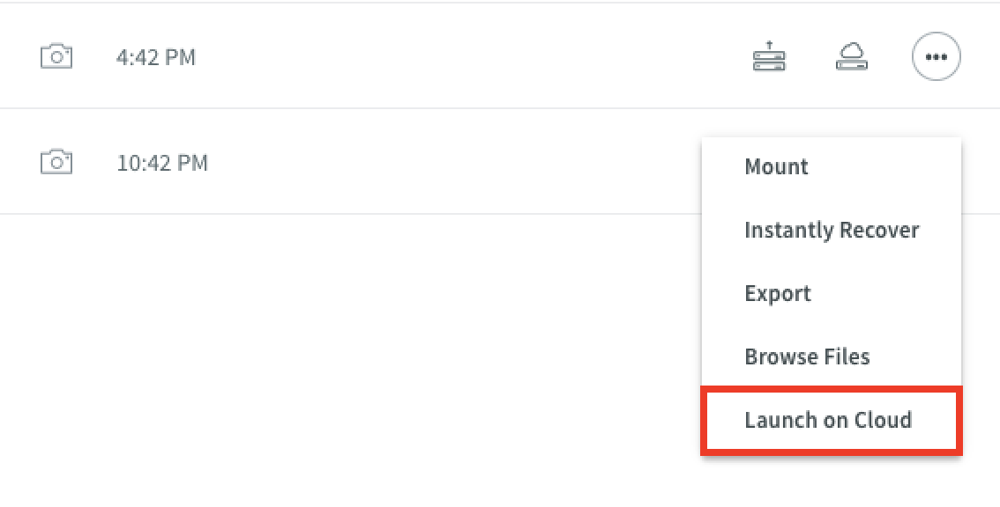

# Launch on Cloud

On the local page for a selected virtual machine, a snapshot is selected and then **Launch on Cloud** is chosen (You will not do this in the lab, shown is an example screenshot).

The Launch on Cloud dialog appears, as shown in the following screenshot.

Toggling the Cloud Provider between AWS and Azure will result in being prompted for the vendor appropriate elements for instantiation. The following screenshot demonstrates the required inputs for both AWS and Azure.

The conversion time varies depending on the size of the VM being converted into a cloud instance.